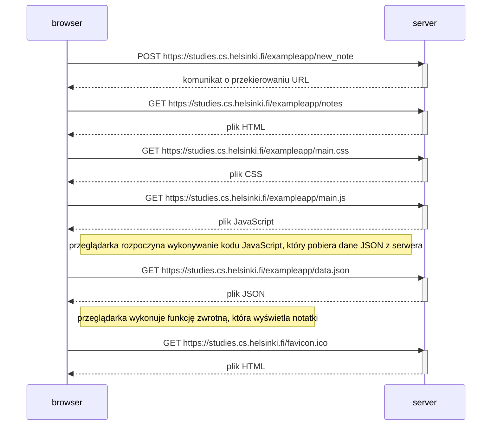

```mermaid
sequenceDiagram
participant browser
participant server

    browser->>server: POST https://studies.cs.helsinki.fi/exampleapp/new_note
    activate server
    server-->>browser: komunikat o przekierowaniu URL
    deactivate server

    browser->>server: GET https://studies.cs.helsinki.fi/exampleapp/notes
    activate server
    server-->>browser: plik HTML
    deactivate server

    browser->>server: GET https://studies.cs.helsinki.fi/exampleapp/main.css
    activate server
    server-->>browser: plik CSS
    deactivate server

    browser->>server: GET https://studies.cs.helsinki.fi/exampleapp/main.js
    activate server
    server-->>browser: plik JavaScript
    deactivate server

    Note right of browser: przeglądarka rozpoczyna wykonywanie kodu JavaScript, który pobiera dane JSON z serwera

    browser->>server: GET https://studies.cs.helsinki.fi/exampleapp/data.json
    activate server
    server-->>browser: plik JSON
    deactivate server

    Note right of browser: przeglądarka wykonuje funkcję zwrotną, która wyświetla notatki

    browser->>server: GET https://studies.cs.helsinki.fi/favicon.ico
    activate server
    server-->>browser: plik HTML
    deactivate server
```
