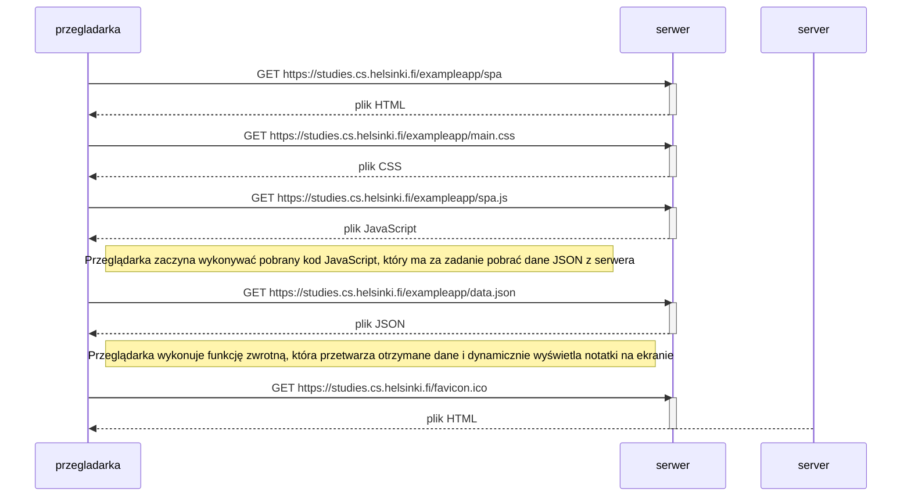

```mermaid
sequenceDiagram
participant przegladarka
participant serwer

    przegladarka->>serwer: GET https://studies.cs.helsinki.fi/exampleapp/spa
    activate serwer
    serwer-->>przegladarka: plik HTML
    deactivate serwer

    przegladarka->>serwer: GET https://studies.cs.helsinki.fi/exampleapp/main.css
    activate serwer
    serwer-->>przegladarka: plik CSS
    deactivate serwer

    przegladarka->>serwer: GET https://studies.cs.helsinki.fi/exampleapp/spa.js
    activate serwer
    serwer-->>przegladarka: plik JavaScript
    deactivate serwer

    Note right of przegladarka: Przeglądarka zaczyna wykonywać pobrany kod JavaScript, który ma za zadanie pobrać dane JSON z serwera

    przegladarka->>serwer: GET https://studies.cs.helsinki.fi/exampleapp/data.json
    activate serwer
    serwer-->>przegladarka: plik JSON
    deactivate serwer

    Note right of przegladarka: Przeglądarka wykonuje funkcję zwrotną, która przetwarza otrzymane dane i dynamicznie wyświetla notatki na ekranie

    przegladarka->>serwer: GET https://studies.cs.helsinki.fi/favicon.ico
    activate serwer
    server-->>przegladarka: plik HTML
    deactivate serwer
```
